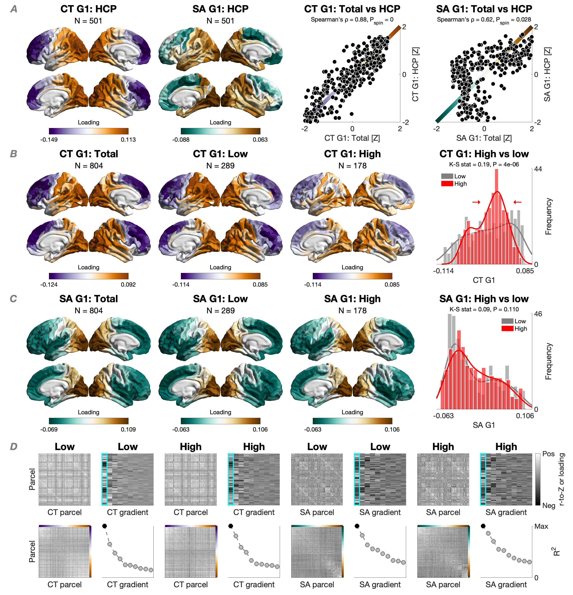

# EmpathyPsychopathy
This repository is associated  with the following article:

Marcin A. Radecki, J. Michael Maurer, Keith A. Harenski, David D. Stephenson, Erika Sampaolo, Giada Lettieri, Giacomo Handjaras, Emiliano Ricciardi, Samantha N. Rodriguez, Craig S. Neumann, Carla L. Harenski, Sara Palumbo, Silvia Pellegrini, Jean Decety, Pietro Pietrini, Kent A. Kiehl, & Luca Cecchetti. Cortical Structure in Relation to Empathy and Psychopathy in 800 Incarcerated Men. Biological Psychiatry: Global Open Science, 100695, 6(3). https://doi.org/10.1016/j.bpsgos.2026.100695

Materials in the data/incarcerated/ and data/HCP/ directories are cortical results (standardised betas or gradient loadings) presented in Figures 2, 4-6, S2, S3, and S11-S13, and in Tables S6-S10. Figures in the figures/ directory are pre-production versions.

  

This work was supported by the National Institute of Mental Health (Grant Nos. R01 MH070539 [principal investigator (PI): KAK], R01 MH114028 [PI: CLH], and R01 MH071896 [PI: KAK]); by the National Institute on Drug Abuse (Grant Nos. R01 DA026505 [PI: KAK], R01 DA026964 [PI: KAK], and R01 DA020870 [PI: KAK]); by the National Institute of Child Health and Human Development (Grant No. R01 HD092331 [PI: KAK]); by the National Institute of Neurological Disorders and Stroke (Grant No. R01 NS126742 [PI: KAK]); and by the Italian Ministry of Education and Research (Grant No. PRIN2020 2020WSCSLZ [“Hot for genes – the role of brain gene expression in identifying antisocial developmental trajectories and malleable risk factors for preventive interventions”; PI: SPe]).

Data were provided [in part] by the Human Connectome Project, WU-Minn Consortium (Principal Investigators: David Van Essen and Kamil Ugurbil; 1U54MH091657) funded by the 16 NIH Institutes and Centers that support the NIH Blueprint for Neuroscience Research; and by the McDonnell Center for Systems Neuroscience at Washington University.
